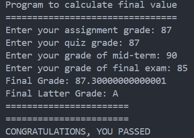
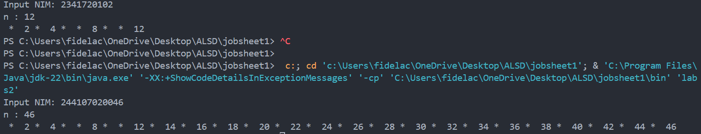
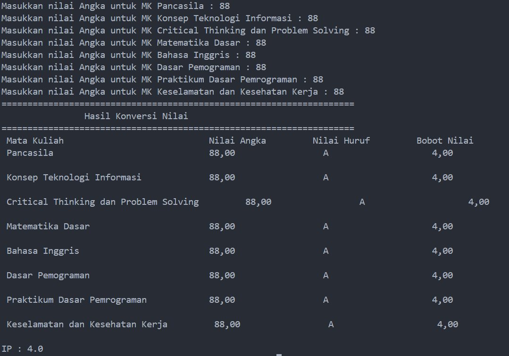
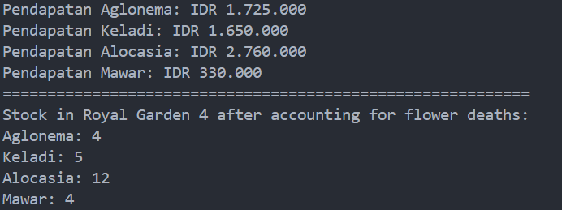
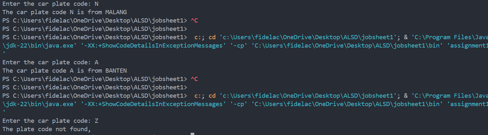
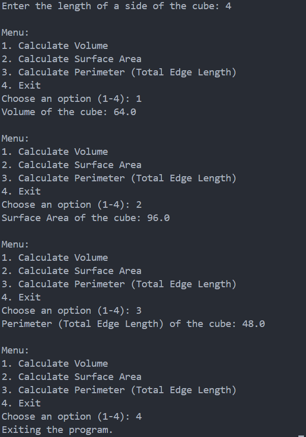
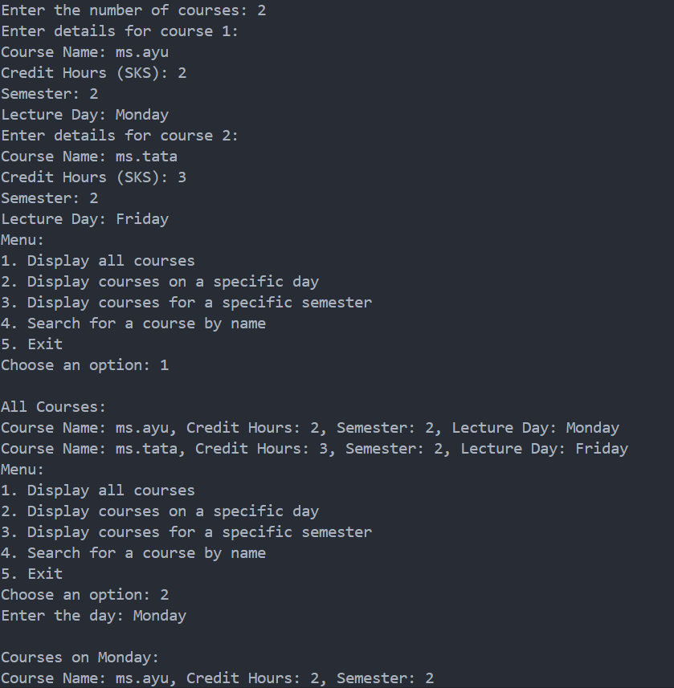

|  | Algorithm and Data Structure |
|--|--|
| NIM |  244107020046  |
| Nama |  Fidela Clarisa |
| Kelas | TI - 1I |
| Repository | [link] (https://github.com/fidelac/ALSD.git) |

# Labs #1 Programming Fundamentals Review

## 2.1.1. Selection Solution

The solution is implemented in Pemilihan1.java, and below is screenshot of the result.

**Brief explanation:** There are 4 main step: 
1. Input all grades
2. Validate the input
3. Calculate and convert the final grade
4. Decide the final status

## 2.2.1. Lopping Solution

**Brief explanation**  There are 5 main step:
1. Input NIM
2. Extracting the last two digit of the NIM (n)
3. Skipping the number 6 and 10
4. Check for even number
5. Printing for odd number (*)

## 2.3.1. Array Solution

**Brief explanation**  There are 4 main step:
1. Input all grades
2. Validate the input
3. Calculate the grade to numerical and weight
4. Print all grade

## 2.4.1. Function Solution

**Brief explanation**  There are 5 main step:
1. Variable Initialization and Data Setup
2. Calculating and Displaying Revenue 
3. Adjusting and Displaying Stock in Royal Garden 4
4. Calculate Income if All Flowers are Sold
5. Print output

## 3.1.1. Assignment 1

**Brief explanation**  There are 5 main step:
1. Define Data Arrays
2. Input code
3. Search for the Code
4. Output the City Name
5. If no match, Invalid Input 

## 3.2.1. Assignment 2

**Brief explanation**  There are 10 main step:
1. Input cube side length
2. Menu display
3. Choose an option
4. Process choice
5. Option 1 = Calculate Volume
6. Option 2 = Calculate Surface
7. Option 3 = Calculate Perimeter
8. Loop Back for Next Option
9. Calculate of the cube
10. Option 4 = Exit program

## 3.2.1. Assignment 3

**Brief explanation**  There are main step:
1. Input Course
2. Menu System
3. Option 1 = Display All Courses
4. Option 2 = Display Courses on a Specific Day
5. Option 3 = Display Courses for a Specific Semester
6. Option 4 = Search for a Course by Name
7. Looping Menu
8. Option 5 = Exit Program

