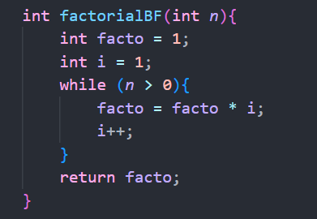
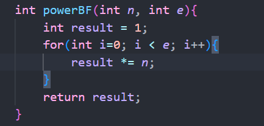

|  | Algorithm and Data Structure |
|--|--|
| NIM |  244107020046  |
| Nama |  Fidela Clarisa |
| Kelas | TI - 1I |
| Repository | [link] (https://github.com/fidelac/ALSD.git) |

# Labs  #5 BRUTE FORCE AND DIVIDE CONQUER

## 5.2 Calculating Factorial Using Brute Force and Divide and Conquer Algorithms
**Answer**
1.  - if(Base Case) : This condition for the stopping point for recursion
    - else(Conquer algorithm) : This condition to continues the recursion by breaking down the problem until the base case is reached

2.  The while loop is an alternative to the for loop commonly used for factorial calculations. The equivalent for loop would look like this:

Both loops achieve the same result, but the while loop explicitly modifies n inside the loop rather than using a separate loop control variable.

3. - facto = facto * i; (Brute Force / Iterative Approach)
        - Used in the Brute Force (factorialBF) method, which uses a loop to calculate factorials.
        - facto is a variable that gradually accumulates the product in each iteration of the loop.
        - i increments in each iteration, meaning the factorial is calculated step by step using iteration.

    - int facto = n * factorialDC(n-1); (Divide and Conquer / Recursive Approach)
        - Used in the Divide and Conquer (factorialDC) method, which applies recursion.
        - Instead of using a loop, the function calls itself recursively (factorialDC(n-1)).
        - Each function call reduces n until reaching n == 1 (base case).

4.  - Approach
        - factorialBF : Iterative (loop while)
        - factorialDC : Recursive, call itself

    - Speed
        - BF : fast and does not use much memory
        - DC : can be slower due to mutiple function calls

    - Efficiency 
        - BF : more memory efficient
        - DC : use more memory (recursion stack)

    - Advantage 
        - BF : easy to understand and implement
        - DC : suitable for recursive problem solving 

    - Disadvantage
        - BF : not flexible for certain algortihm problems
        - DC : can cause stack overflow if n is too large

## 5.3 Calculating Exponentiation Using Brute Force and Divide and Conquer Algorithms
**Answer**
1. a. powerBf() : Brute Force Method
    - Multiplies the base number repeatedly for the given exponent. Time complexity is O(n) because it uses a loop.
    b. powerDC() : Devide and Conquer Method
    - Uses recursion to break the problem into smaller parts. Time complexity is O(log n) since it reduces the exponent in each step, making it faster for large numbers.

2.  - Divide Step: The problem is divided into smaller      subproblems by calculating : powerDC(n, e/2)
    - For even exponents : return powerDC(n, e/2)*powerDC(n, e/2);
    - For odd exponents : return n * powerDC(n, e/2) * powerDC(n, e/2);

3. No, the parameters in the powerBF() method are not necessary since the Power class already has attributes (baseNumber and exponent). The method can be implemented without parameters by directly using these attributes.

4.  - powerBF()
        - Uses a loop to multiply the base number by itself exponent 
        times.
        - Simple and straightforward but less efficient for large exponents.
        - Time complexity: O(n).
        

    - powerDC()
        -  Uses a recursive approach to divide the problem into smaller subproblems.
        - Combines the results of the subproblems to get the final result.
        - More efficient for large exponents due to its logarithmic time complexity.
        - Time complexity: O(log n).

## 5.4 Calculating Array Sum Using Brute Force and Divide and Conquer Algorithms
**Answer**
1.  - mid is needed to divide the array into 2 part, so the divide and conquer method can run properly
    - prevent infinite recursion and ensure the program reaches a halting condition
    - to help faster calculating

2. - lsum and rsum ensure that the array is deivided into two part and each part is processed separately
    - double lsum = totalDC(arr, l, mid); 
        - Recursively calculate the sum of the left half of the array
        -  totalDC() called again, but only for index l into mid
        - this process continue until it reaches a single element (basecase)

    - double rsum = totalDC(arr, mid + 1, r)
        - Recursively calculate the sum of the right half of the array
        - totalDC() called againn for the part between mid + 1 and r
        - this process continue until it reaches a single element, like the left half

3.  - summing lsum and rsum is necessary to correctly combine the devided part
    - without adding them the final sum would be incomwplete or incorrect
    - follow the divide and conquer principle : divide - solve - combine (pecah - hitung - gabungkan)

4. The base case of the totalDC() = 
        if (l == r) {
        return arr[l];
        }
    - if (l == r ) means the array has only one element left
    - when l (left index) and r (right index) are the same, meaning the subarray being processed contains only one element
    - the function return that single element (arr[1]), stopping futher recursion 
5. The totalDC() method uses:
    - divides the array into smaller subarray
    - conquers each subarray by recursively calculating their sums
    - combines the result of the subarrays to produce the final sum. This approach is efficient for large array, with time complexity of O(log n)

## 5.5 Assigment

[code](Student.java)

[code](StudentMain.java)
1. create student data
    - StudentMain.java create student array containing Student object, eact with name, student id, year of admission, midterm exam, and final exam
2. find score maximum UTS
    - student array divided into 2 parts until one element left
    - find score max in each parts
    - combine the result by taking the highest value from the 2 parts
3. find score minimum UTS
    - same as find score maximum, but find smalles value
4. calculate average UAS
    - use Brute Force method
    - add up all the UAS score and then divide them by the number of student
5. display the result
    - StudentMain.java call the method in Student.java to display max score value, min score value, and average value

Result

