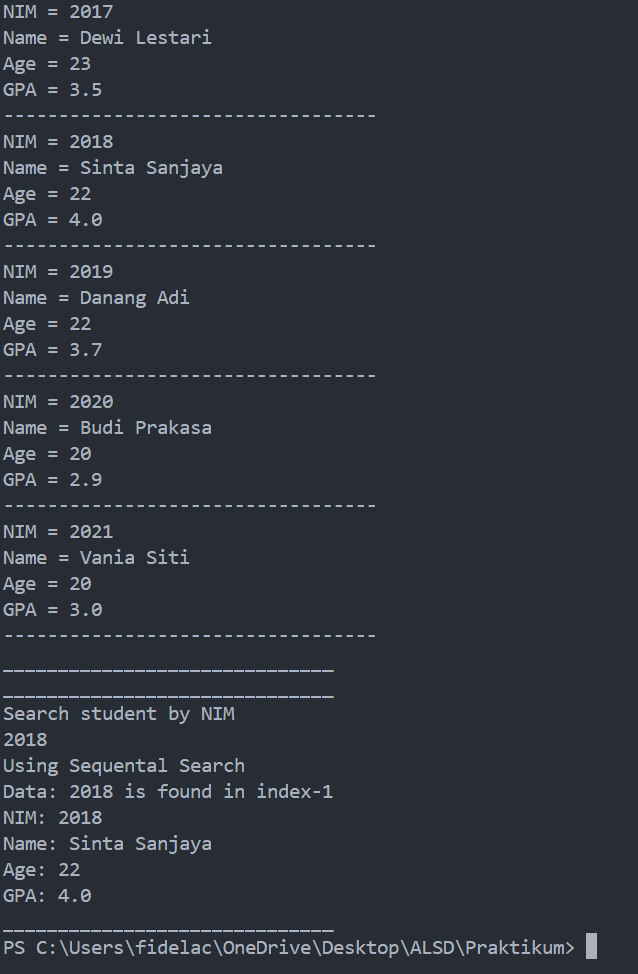
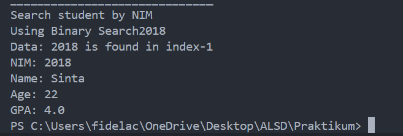

|  | Algorithm and Data Structure |
|--|--|
| NIM |  244107020046  |
| Nama |  Fidela Clarisa |
| Kelas | TI - 1I |
| Repository | [link] (https://github.com/fidelac/ALSD.git) |

# Labs #6 SEARCHING

## Sequential Search Method
## Question!
**Answer**

1. 
- Pupose
    - showPosition : Display the index of the student in the array
    - showData : Display detail information about the student
- output 
    - showPosition : Only the position / not found massage
    - showData : Full detail of the student / not found massage
- case
    - showPosition Use when you only need to know where the student located in the array
    - showData use when you need to display the full detail of the student

2. The break statement is used to immediately exit the for loop once the condition "listStd[i].nim ==" search is satisfied. This means that as soon as the program finds the student with the matching nim (student ID), it stops further iterations of the loop.

3. No, it will not encounter an error. And result will still be correct, because the findSeqSearch method use sequential search, which does not require the data to be shorted and it check each element individually and correctly indentifrs the position of the first matching 'nim'

4. It is a sentiel value that clearly indicates the  search value was not found and it avoid confusion with valid array indicates(which start from 0), if used 0 it could lead to incorrect result, as 0 is a valid index and might false indicate that the search value is located at index 0.

## Binary Search Method
## Question
**Answer**

1. Devide Process : 
mid = (left + right) / 2;
    - The array is split into two halves by calculating the mid index

2. Conquer Process : 
 if (listStd[mid].nim > cari) {
    return FindBinarySearch(cari, left, mid - 1); // Left half
} else {
    return FindBinarySearch(cari, mid + 1, right); // Right half
}     
    - the algorithm recursively search in the left or right half based on the comparison.

3. No, the program will not give the correct result if the nim data is not sorted. Because binary search in ascending order to work coreectly. If the element being searched is 20210, the binary search will not return the correct result, because the current implementation assumes the data is sorted in ascending order. To make the binary search work for data sorted in descending order, you need to modify the comparison logic in the FindBinarySearch method. 

