|  | Algorithm and Data Structure |
|--|--|
| NIM |  244107020046  |
| Nama |  Fidela Clarisa |
| Kelas | TI - 1I |
| Repository | [link] (https://github.com/fidelac/ALSD.git) |

# Labs #11

## Question 2.1.3
1. - front = rear = -1:
        - Indicates an empty queue
        - -1 is an invalid index, showing no elements exist.
        - When the first element is added (enqueue), both front and rear are set to 0.

    - size = 0 
        - Directly tracks the number of elements.
        - A size of 0 confirms the queue is empty, aligning with front and rear = -1.

2. - This snippet heandles circular queue behavior, when rear reaches the end of the array (max -1), it wrap around to 0.
- purpuso : Reuse empty spaces at the fron of the array ( if dequeue earlier)

3. - This enables circular dequeueing, when front reaches the end (max-1), it reset to 0
- pupose : maintain FIFO order while reusing space

4. the front pointer represent the index of the forst element in the queue. The queue does not necessarily start at index 0, because element are added and removed dynamically.

5. The line is commonly used in circular queue implementations.
    - i is the current index in the queue.
    - (i + 1) increments the index to point to the next position in the queue.
    - % max ensures that the index wraps around to the beginning of the queue when it reaches the end (max is the maximum size of the queue).

6. if ((rear + 1) % max == front) {
    System.out.println("Queue is full! Overflow condition.");
}
    - this condition checks if the next posotion of rear equals front, whixh indicates the queue is full.
    
7. ![Screenshot] (../img/jobsheet11/Modify7.png)  
    This ensures the program halts execution when an overflow or underflow occurs

## Question 2.2.3
1.  - Queue : manages primitive data type (int).
    - StudentQueue : manages object of the student class
This change is important because is allows studentQueue to handle ma=ore complex data structures , enabling the storage of multiple attribute (nim, name, studyProgram, className) in a single queue element. 

2.  - enqueue:
        - (queue) it adds an int to the queue
        - (StudentQueue) it adds a Student object to the queue, requiring the methode to handle object references instead of primitive value.
    
    - dequeue:
        - (queue) it removes and return an int.
        - (StudentQueue) its removes and returns a student object, which can then be used to acces its attributes or invoke method.

3.  - Queue, front is initializwed to -1 to indicate that the queue is empty. this is cammon practice when using a non circular queue
    - StudentQueue, front is initialized to 0 because it likely use a circular queue implementation, where front always points to the first valid element.

4.   
    
        - (size == 0) this method checks if the queue is empty
        - if the queue is not empty, it retrieves and display the element at the rear index of the queue
        - This useful for inspecting the last element added to the queue

## Assignment
- Circular Index
    - rear = (rear + 1) % max = so that when it reaches the limit, it returns to the beginning.
    - front = (front + 1) % max =  processes from the front.

- Method
    - enqueue() = adds data to the queue.
    - dequeue() = processes removes the first 2 data at once.
    - isFull() & isEmpty() = validates the queue boundaries.
    - printAll(), printFirstTwo(), printRear() = views the contents of the queue.
    - printStats() = displays statistics (from a total of 30 students).
    - clear() = resets the index and size of the queue.

- Menu Option
    - 1. Register Student (Enqueue)
        - user is asked to input data
        - 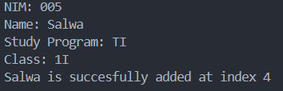 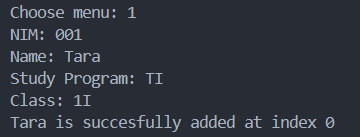 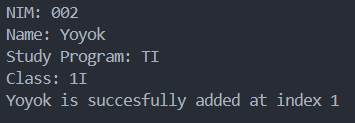 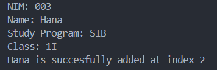 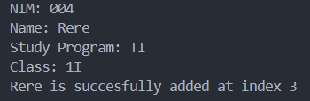
        - data will be saved to the queue

    - 2. Process KRS Approval (Dequeue)
        - If empty = displays "Queue is empty!" and exits the method.
        - determine the amount to be processed: (processed = Math.min(2, size))
        - Take the 2 leading student data, and display the data
        - 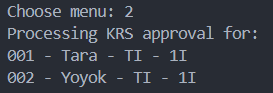
        - The queue will move forward (front moves),
        - size decreases by 2, and
        - approved increases by 2.

    - 3. Show All Students in Queue
        - Displays all students currently in the queue = (display student data that has not been processed krs).
        - 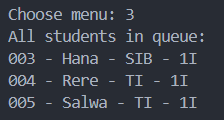

    - 4. Show First Two Students
        - Showing the top 2 in the queue.
        - 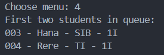

    - 5. Show Last Student
        - Displays the last student in the queue.
        - 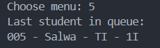

    - 6. Clear Queue
        - 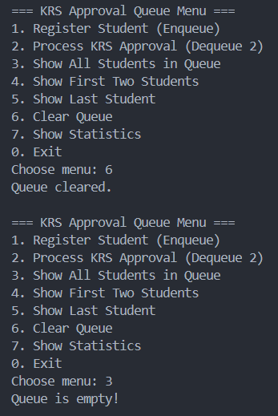

    - 7. Show Statistics
        - 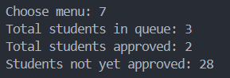
        - this method is called: printStats();
        - size = number of students still waiting in the queue.
        - approved = number of students who already passed the KRS approval.
        - maxStudents = maximum students that one DPA can handle.
        - maxStudents - approved = number of students not yet approved

