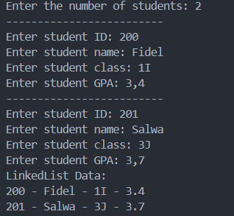

|  | Algorithm and Data Structure |
|--|--|
| NIM |  244107020046  |
| Nama |  Fidela Clarisa |
| Kelas | TI - 1I |
| Repository | [link] (https://github.com/fidelac/ALSD.git) |

# Labs #12

## Question 2.1.2
1. Because the first statement after creating the SingleLinkedList object is sll.print(), and at this point, the list is still empty/no nodes have been yet. The print() method checks if the list is empty and print "Linked List is Empty" if there are no nodes.

2. The vairable temp us typically used as a tempory pointer/reference to taverse or manipulate nodes in the linked list. 

3.    
     - [Code](MainModify.java)
     - 

4. Yes, without tail, the addLast operation has to traverse the entire list from the head to find the last node, making the operation time O(n) instead of O(1). tail allows direct access to the last node, making the operation more efficient.

## Question 2.2.3
1. break is used to stop the loop after the searched element is found and removed. Without break, the program will continue to traverse the list even though the data has been removed, which can lead to errors or inefficiencies.

2.  - temp.next = temp.next.next: Deletes the target node by ignoring it (cutting references to it).
    - if (temp.next == null) { tail = temp; }: If the node being deleted is the last element, tail is updated to the previous node.
