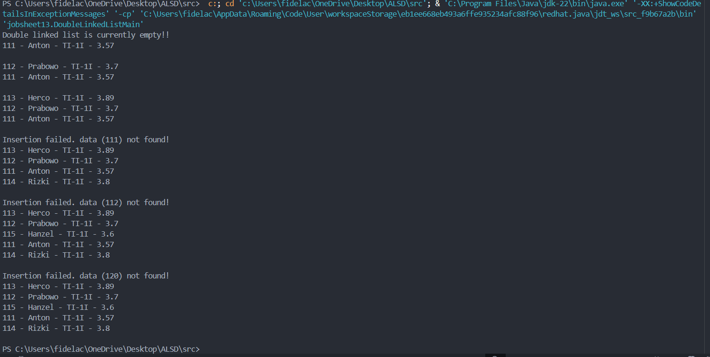
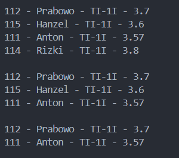
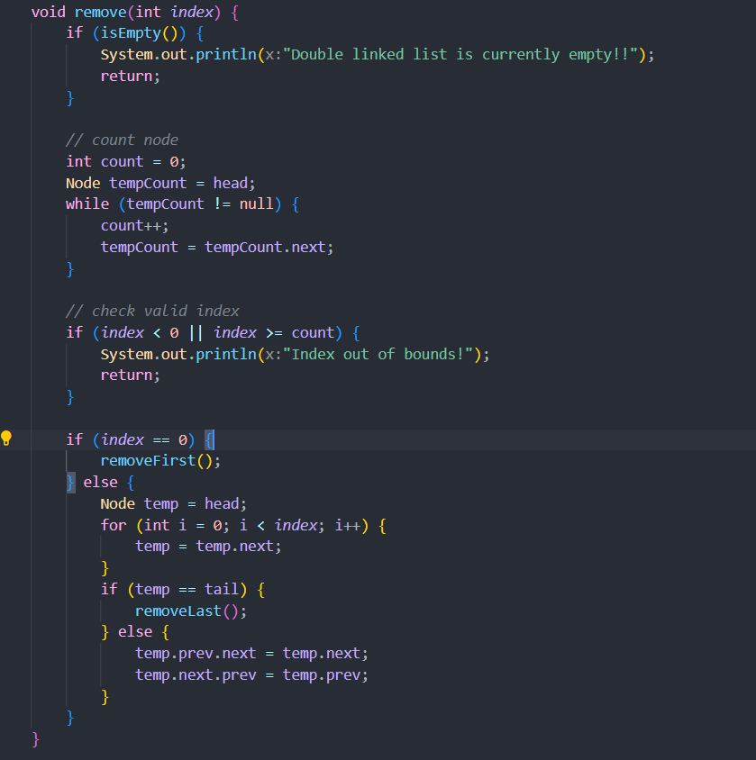

|  | Algorithm and Data Structure |
|--|--|
| NIM |  244107020046  |
| Nama |  Fidela Clarisa |
| Kelas | TI - 1I |
| Repository | [link] (https://github.com/fidelac/ALSD.git) |

# Labs #13

## Question 12.2.3 

1. - On number of pointer
        - Single : each node has only 1 pointer (next) that points to the next node.
        - Double : each node has 2 pointer, that is next (to the next node) and prev (to the previous node)
    - On traversal
        - SIngle : just one way/come forward
        - Double : can be two-way /forward and backward

2.  - pointer next : connect to the next node in the list.
    - pointer previous : to connect previous node in the list.
 
3. Initializes the list to be empty when the object is created, with head and tail being null.

4. If the list is empty, the new node becomes both the first and last node (head and tail point to the same node).

5. Connect the old first node (head) to the new node in front of it, so that the new node becomes the node before the head.

6. Connect the node after current to new node, Menghubungkan node setelah current ke node baru sebagai node sebelumnya (prev), agar link dua arah tetap terjaga.

7. temp = temp.next means moving to the next node in the list during traversal.

8. If the node being searched for is the tail, then new data is immediately added to the end of the list.
If deleted: Adding a node after the tail will not work, so new data will not be entered if the key is in the tail.

9. To search for nodes with a certain NIM (key) in a case-insensitive manner, as a reference for inserting new nodes after that node.

10. 

## Question 12.3.3

1.  - head = head.next; moves the head pointer to the next node, efectively removing the first node
    - head.prev = null; removes the backward link from the new head to the old (now removed) node, ensuring the list remains properly linked

2. To handle the case when the list only has one node. After removing it, bith head and tail must be set to null to indicate the list is empty

3. must traverse the list from head to find the last node and its previous node. then , set the previous node next to null and update tail logic accordingly, this makes the operation O(n) instead of O(1)

4. To prevent errors by ensuring you do not attempt to remove a node from an empty list.

5.  - at the biginning (index == 0 ) calls removeFirst() to remove the head node
    - at the end (temp == tail) call removeLast() to remove the tail node

6. It sets temp.prev.next = temp.next and temp.next.prev = temp.prev, bypassing the node to be removed and linking its previous and next nodes directly.

7.  

## Assignment

1.   
     // Add an add() function 
    void add(int index, Student data) { // menambahkan node baru di posisi/index tertentu

        if (index < 0 || index > size()) 
            System.out.println("Index out of bounds!");
            return;
        }
        if (index == 0) {
            addFirst(data);
        } else if (index == size()) {
            addLast(data);
        } else {
            Node newNode = new Node(data);
            Node temp = head;
            for (int i = 0; i < index - 1; i++) {
                temp = temp.next;
            }
            newNode.next = temp.next;
            newNode.prev = temp;
            temp.next.prev = newNode;
            temp.next = newNode;
        }
    

2. 
    // Add remove After
    
    void removeAfter(String key) {

        Node temp = head;
        while (temp != null) {
            if (temp.data.nim.equalsIgnoreCase(key)) {
                if (temp.next != null) {
                    Node toRemove = temp.next;
                    if (toRemove == tail) {
                        removeLast();
                    } else {
                        temp.next = toRemove.next;
                        if (toRemove.next != null) {
                            toRemove.next.prev = temp;
                        }
                    }
                } else {
                    System.out.println("No node after " + key + " to remove.");
                }
                return;
            }
            temp = temp.next;
        }
        System.out.println("Node with key " + key + " not found.");
    }

3. 
    // Add get first
    Student getFirst() {

        if (isEmpty()) {
            System.out.println("Double linked list is currently empty!!");
            return null;
        }
        return head.data;
    }

    // Add get last
    Student getLast() {

        if (isEmpty()) {
            System.out.println("Double linked list is currently empty!!");
            return null;
        }
        return tail.data;
    }

    // Add get at index
    Student getIndex(int index) {

        if (index < 0 || index >= getSize()) {
            System.out.println("Index out of bounds!");
            return null;
        }
        Node temp = head;
        for (int i = 0; i < index; i++) {
            temp = temp.next;
        }
        return temp.data;
    }

4. 
    // Add get size
    int getSize() {

        int count = 0;
        Node temp = head;
        while (temp != null) {
            count++;
            temp = temp.next;
        }
        return count;
    }

5. 
    // Add index of
       int indexOf(String key) {

        Node temp = head;
        int index = 0;
        while (temp != null) {
            if (temp.data.nim.equalsIgnoreCase(key)) {
                return index;
            }
            temp = temp.next;
            index++;
        }
        return -1; // not found
    }