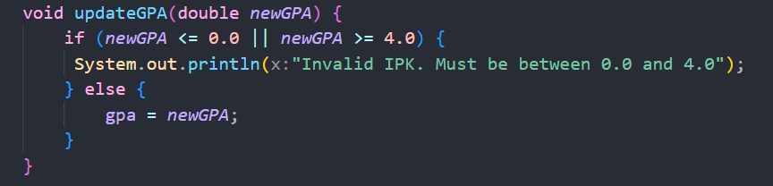
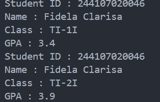
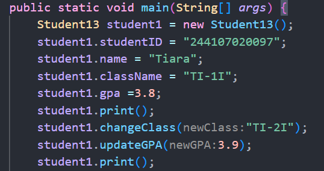
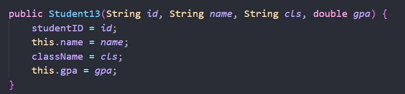
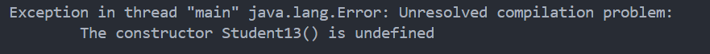
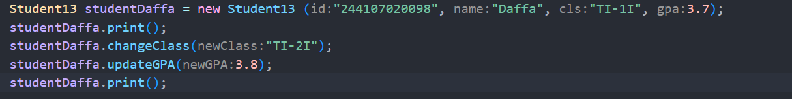
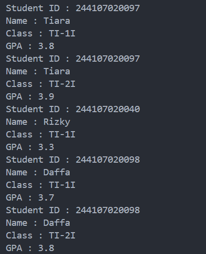
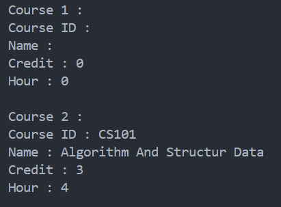
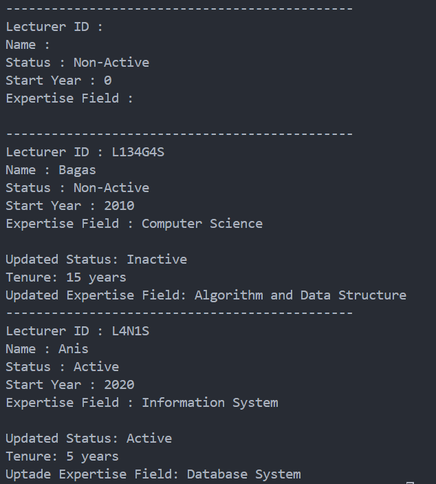

|  | Algorithm and Data Structure |
|--|--|
| NIM |  244107020046  |
| Nama |  Fidela Clarisa |
| Kelas | TI - 1I |
| Repository | [link] (https://github.com/fidelac/ALSD.git) |

# Labs #2 Object

## 2.1 Experiment 1: Declaring Classes, Attributes, and Methods
**Answer**  
1. Properties(Atribut), Methods (Metode)
2. The Student class has 4 attributes, which are:
    - studentID (String)
    - name (String)
    - className (String)
    - gpa (double)
3.  The Student class has 4 methods, which are:
    - print() 
    - changeClass(String newClass) 
    - updateGPA(double newGPA) 
    - evaluate() 
4.  

5.   The evaluate() Method in class Student13 is used to acsess a students perfomance based on their GPA 
    - GPA ≥ 3.5 = if the student GPA is 3.5 or higher, the student perfomance is "Excellent".
    - GPA ≥ 3.0 and < 3.5 = if the student  GPA is between 3.0 and 4.5, the student perfomance is "Good".
    - GPA ≥ 2.5 and < 3.0 = if the student GPA is between 2.5 and 3.0, the student perfomance is "Fair".
    - GPA < 2.5 = if the student GPA is below 2,5, the student perfomance is "Poor".
    The output of the method is a String that indicates the student's performance level, such as "Excellent", "Good", "Fair", or "Poor".

## 2.2 Experiment 2: Object Instantiation and Accessing Attributes and Methods 

**Answer**
1. 
2. To access attribute and methods of an object, use the dot (.) operator.
3. The difference in output is due the changes made to the className and gpa attributes between the two call to print(). After the first call, the class name and GPA were updated, so the second call reflects those updates.

## 2.3 Experiment 3: Creating Constructor
1. 
2. Creates a new instance of the Student13 class and assigns it to the student2 variable. It uses the constructor of the Student13 class, passing    four arguments: student ID ("244107020040"), name ("Rizky"), class name ("TI-1I"), and GPA (3.5). These values are then used to initialize the corresponding attributes of the student2 object.
a Student13 object, student2, with the following attributes:
studentID: "244107020040"
name: "Rizky"
className: "TI-1I"
GPA: 3.5
3. removing the default constructor causes the program to break when trying to instantiate the object with new Student13() because that constructor no longer exists. Without a default constructor, it is no longer possible to create a Student13 object without passing parameters, because the class only has constructors that require certain arguments.

4. No, methods in the Student13 class do not need to be accessed in a specific order after instantiating an object. However, the order in which you call the methods can affect the state of the object and the output of the program
5. 

## 2.4 Assignments

1. a : Course13.java -> Represents a course with relevant attributes and methods.

        Attributes : courseID(String), name(String), credit(int), hour(int)

        Methods : print(), changeCredit(int newCredit), addHour(int hour), reduceHour(int hour)

        Constructors : Parameterized constructure, default constructor
        
   b : CourseMain13.java -> The main program to test object form the Course13 class
     - Create a Course13 object using the default constructor.
        - All attributes will have empty or zero values.
        - Display Course13 information.
     - Create a course2 object using the parameterized constructor.
        - courseID: "CS101", Name: "Algorithm And Structure Data", Credit: 3, Hour: 4.
        - Display course2 information.
     - Modify Course13
        - Change the number of credits to 3.
        - Add 3 lecture hours.
        - Reduce 1 lecture hour.
     - Modify course2
        - Change the number of credits to 4.
        - Add 2 lecture hours.
        - Reduce 1 lecture hour.
    

        

2. a : Lecturer13.java -> Represent a lecturer with relevan attributes and methods.

        Attributes : lecturerID(String), name(String), status(boolean), startYear(int), expertiseFIeld(String)

        Methods : print(), setStatus(boolean status), calculateTenure(int yearNow), changeExpertiseField(String newExpertiseField)

        Constructors :  Parameterized constructure, default constructor

   b : LecturerMain13.java -> The main program to test object form the Lecturer13 class
    - Create a Lecturer13 object using the default constructor.
        - All attributes will have empty or zero values.
        - Call print() to display initial data
    - Create a Lecturer13 object using the parameterized constructors
        - ID: "L134G4S", Name: "Bagas"  Status: false(non-active), startYear: 2010, ExpertiseField: "Computer Science"
        - ID: "L4N1S", Name:"Anis", Status true(active), startYear: 2020, ExpertiseField "Information System";
        - Call print() to display the lecturer details
     - Modify Lecturer13 data
        - Updates the status to inactive using setStatus(false).
        - Calculates the tenure up to the year 2025 using calculateTenure(2025).
        - Changes the expertise field to "Algorithm and Data Structure".
        - Prints the updated status, tenure, and expertise field.
    