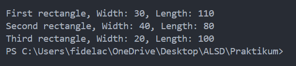
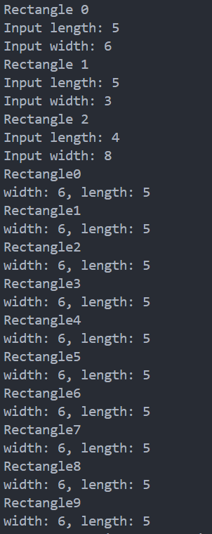
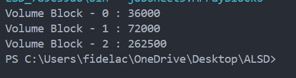
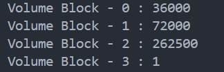
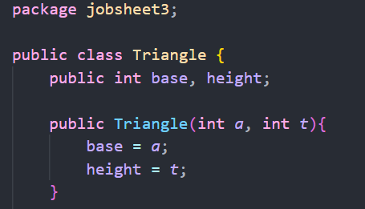
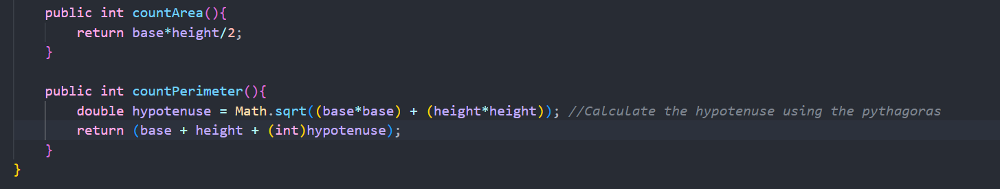
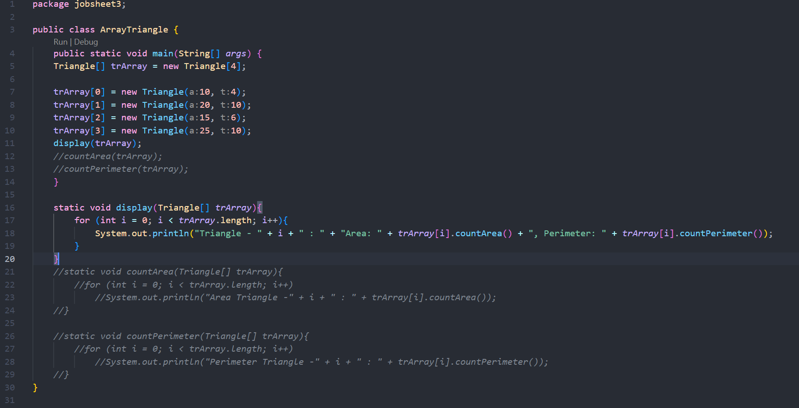
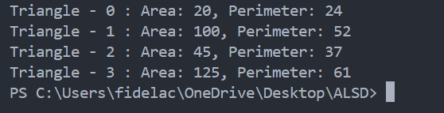

|  | Algorithm and Data Structure |
|--|--|
| NIM |  244107020046  |
| Nama |  Fidela Clarisa |
| Kelas | TI - 1I |
| Repository | [link] (https://github.com/fidelac/ALSD.git) |

# Labs #3 Array Of Object

## 1.2 Create, insert, and display Array of Object
**Answer**

1. No, classes that will be used as arrays of objects do not have to have methods, but must have attributes because objects need to store data.
2. No, the Rectangle class does not have an explicitly defined constructor. Java automatically provides this constructor,this line: rectangleArray[1] = new Rectangle();
It creates a new Rectangle object in memory, with its attributes (length and width) set to their default values (0 for integers).
3. Rectangle[] rectangleArray = new Rectangle[3]; --> The line declares and initializes an array of Rectangle objects with a size of 3(can hold up to 3 rectangle object).The elements in rectangleArray[] have null values ​​because the object has not been created.
4.  - rectangleArray[1] = new Rectangle(); --> Create a new object rectangle and stores the first index of the rectangleArray
    - rectangleArray[1].length = 80; --> Change the length attributes value of the rectangle object at the first index to 80
    - rectangleArray[1].width = 40; --> Change yhe width attributes value of the rectangle object at the first index to 40
5. The Rectangle class and ArrayOfObject class should be separated to follow the separation of concerns principle.
    - Rectangle class: Manages the properties and behaviors of a rectangle.
    - ArrayOfObject class: Handles creating and operating on an array of Rectangle objects.
    This separation makes the code more modular, maintainable, and reusable.

## 1.3 Input data into Array of Objects using Loops
**Answer**

1. Yes, an array of objects can be implemented as a 2D array. 2D arrays are essentially arrays of arrays, and each element in a 2D array can be an object.
2. [Example](ArrayOfObject2D.java)
    - Creates a 2D array with 2 rows and 3 columns where each element is a Rectangle object.
    - Initially, all elements are null, and objects need to be instantiated manually.
    - Each element in the array is assigned a new Rectangle object.
    - The length and width properties are set dynamically based on i and j.
3. The error occurs because, although the array squareArray is created with a size of 100, the elements inside the array are initially null.
    - The line squareArray[5].side = 20; tries to access the side attribute of the Square object at index 5.
    - However, since squareArray[5] is still null, there is no actual Square object to assign a value to, resulting in a NullPointerException.
4. [Modify](ModifyArray.java)
5. When ppArray[0] = new Rectangle(); is executed again, the previous object at index 0 will be replaced by the newly instantiated object.
The effect :

    Instantiating an Index Twice:
    - The first object will be overwritten by the second object.
    - The first object will become unreachable and eventually will be cleaned up by the Garbage Collector.
    - Data that was previously in the first object will be lost.

    Copying Object References:
    - When an object reference is copied (ppArray[0] = ppArray[i]), both indices will point to the same object.
    - Changes to the data in one object will affect the other, as they are actually the same object.

## 1.4 Mathematical operation in array of object’s attribute 
**Answer**

1. Yes, can have more than one constructor in one class. This concept is known as construtor overloading. Constructor overloading allows a class to have multiple constructors with different parameter lists. Each constructor can perform different tasks or initialize the object in different ways.
    - A constructor that takes three parameters
    public Blocks(int p, int l, int t){
        length = p;
        width = l;
        heigth =t;
    } 
    - A constructor that takes two parameters, and assumes the "t" is 1
    public Blocks(int p, int l){
        length = p;
        width = l;
        heigth = 1;
    }
    - A dafault constructor that assumes all dimension are 1
     public Blocks(){
        length = 1;
        width = 1;
        heigth = 1;
    }
    - blArray[3] = new Blocks(); //Constructor addition
    --> 
    The result of volume block3 will be 1, because it uses constructor 3 or the default constructor without parameters which is that assumes all dimension are 1
2. 
3. 
4. 
5. 
    --> [Code](Triangle.java)
    --> [Code](ArrayTriangle.java)

## 1.5 Assignments
[Lecturer13](Lecturer13.java)

    - Store lecturer attribute data
    - attribute: id, name, gender, age for stores lecturer data
    - constructor : use to initialise a new lecturer object with its complete data.

[LecturerDemo13](LecturerDemo13.java)

    - run program and manage input from user
    - input data : use Scanner for in fill lecturer data
    - array of object : Lecturer13[] lecturerArray for stores several object Lecturer13
    - call method : called method in LecturerData13 to process and display data

[LecturerData13](LecturerData13.java)

    - showAllLecturerData : display all lecturer data for array
    - countLecturerByGender : calculating the number of lecturer based on gender
    - averageLecturerAgeByGender : calculating average age of male and female lecturer
    - showOldestLecturerInfo : find and display oldest lecturer
    - showYoungestLecturerInfo : find and display youngest lecturer

1. user fill in/enter the number and details of lecturer in LecturerDemo13
2. lecturer data stores as object in the Lecturer13[] 
3. data processed by LecturerData13
    - show in its entirety
    - the number is calculated based on gender
    - average age was calculate
    - looking for the oldest and youngest lecturer
4. result are displayed to the console.
