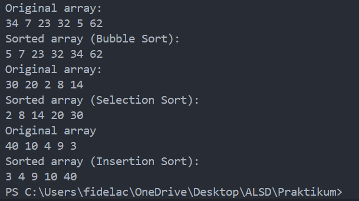

|  | Algorithm and Data Structure |
|--|--|
| NIM |  244107020046  |
| Nama |  Fidela Clarisa |
| Kelas | TI - 1I |
| Repository | [link] (https://github.com/fidelac/ALSD.git) |

# Labs #6 SORTING(BUBBLE, SELECTION, AND INSERTION SORT)

# Experiment 1 
**Answer**
## 6.2.5

1.  - Compare 2 adjacent element in the data array
    - If the left element ([j]) is greater than the right element ([j+1]), they swap places
    - The code is commonly used in the bubble sort algorithm to sort an array in ascending order

2. 
    public void selctionSort(){
        for (int i = 0; i < size - 1; i++){
            int minIndex = i;
            for(int j = i + 1; j < size; j++){
                if (data[j] < data [minIndex]){
                    minIndex = j;
                }
            }
            int temp = data[minIndex];
            data[minIndex] = data[i];
            data[i] = temp;
        }
    }
    - for (int i = 0; i < size - 1; i++) : Iterates through the array, treating the first i elements as sorted and the rest as unsorted.

    - for(int j = i + 1; j < size; j++) : Searching for the smallest element / minimum value

    - 

3. This condition makes sure there is still sata in the shorted part that will be compered with the unsorted data. it ensure that the sorted part always contains elemenets greater than the unsorted element before placing the key in the correct position.

4. to swap data to the right(left data go to the right)

# Experiment 2
**Answer**
## 6.3.4 Questions!
1.  
    a. Loop i < idx - 1 ensures Bubble Sort runs as needed.
    b. Loop j < idx - i - 1 prevents unnecessary comparisons with already sorted elements.
    c. For 50 elements, the loop runs 49 times, performing 49 Bubble Sort stages with a total of 1225 comparisons.

2. 

## 6.3.9 Questions!
To find or search for the smallest, after finding the smallest it will carry out the swepping process

## 6.3.13
 
    public void insertionSort(){
        for (int i = 1; i < idx; i++){
            Student temp = listStudents[i];
            int j = i;

            while (j > 0 && listStudents[j - 1].gpa < temp.gpa){
                listStudents[j] = listStudents[j - 1];
                j = j - 1;
            }
            listStudents[i] = temp;
        }
    }

